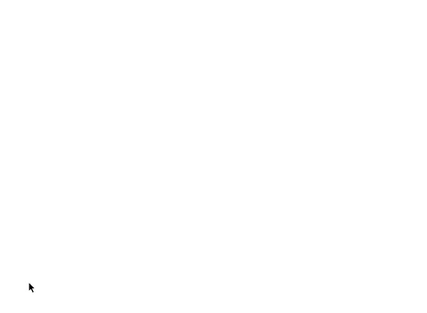

# Python Play (beta)
## The easiest way to start coding games and graphics projects in Python

Python Play is an open-source code library for the Python programming language that makes it as easy as possible to start making games. Here's the code to make a simple game using Play:

```python
import play

cat = play.new_text('=^.^=', font_size=70)

@play.repeat_forever
async def do():
    cat.x = play.random_number(-200, 200)
    cat.y = play.random_number(-200, 200)
    cat.color = play.random_color()
    
    cat.show()

    await play.timer(seconds=0.4)

    cat.hide()

    await play.timer(seconds=0.4)

@cat.when_clicked
async def do():
    cat.show()
    cat.words = 'You won!'

play.start_program()
```

The code above makes a game where you have to click the cat to win:



[You can try playing and changing this game on repl.it!](TODO)


# How to use Python Play

All Python Play programs start with `import play` and end with `play.start_program()`, like this:

```python
import play


play.start_program()
```

All other commands go between those two commands.

To try any of the following examples, go to **[repl.it and try pasting code in](TODO)**.

## Basic Commands

To get images or text on the screen, use `play.new_sprite()` and `play.new_text()`. (Copy and paste the code below to try it out.)

#### `play.new_sprite()`
```python
character = play.new_sprite(image='character.png', x=0, y=0, angle=0, size=100, transparency=100)
```

#### `play.new_text()`
```python
speech = play.new_text(words='hey there', x=50, y=0, angle=0, font=None, font_size=50, color='black', transparency=100)
```

These two commands will put an image with text next to it in the middle of the screen.

#### `play.set_background_color()`
You can also change the background color with the `play.set_background_color()` command:

```python
play.set_background_color('light blue')
```


## Animation

#### `@play.repeat_forever`
To make things move around, you can start by using `@play.repeat_forever`, like this:

```python
cat = play.new_text('=^.^=')

@play.repeat_forever
async def do():

    cat.turn(10)  
```    

The above code will make the cat turn around forever. Sprites have other commands that you can see in the next section called Sprite Commands.

#### `@play.when_program_starts`

To make some code run just at the beginning of your project, use `@play.when_program_starts`, like this:

```python
cat = play.new_text('=^.^=')

@play.when_program_starts
async def do():

    cat.turn(180)  
```

This will just make the cat turn upside down immediately.


#### `await play.timer(seconds=1)`

To run code after a waiting period, you can use the `await play.timer()` command like this:

```python
cat = play.new_text('=^.^=')

@play.when_program_starts
async def do():

    cat.turn(180)  
    await play.timer(seconds=2)
    cat.turn(180)  
```

This will make the cat turn upside down immediately, wait 2 seconds, then turn back up again.


#### `play.repeat()` and `await play.animate()`

To smoothly animate a character a certain number of times, use `play.repeat` with `await play.animate()`, like this:


```python
cat = play.new_text('=^.^=')

@play.when_program_starts
async def do():
    for count in play.repeat(180):
        cat.turn(1)
        await play.animate()
```

This code will animate the cat turning upside down smoothly when the program starts.

To break down the code:
- `for count in play.repeat(180)` runs the code 180 times.
- `cat.turn(1)` turns that cat 1 degree each time.
- `await play.animate()` makes the cat animate smoothly. Without this command, the cat would just turn upside down instantly.


### Sprite Commands

image
x,y
size
angle
transparency
width
height

`sprite.move()`

`sprite.turn()`

`sprite.go_to()`

`sprite.point_towards()`

--

`sprite.hide()`

`sprite.show()`

--

`sprite.distance_to()`

--

`sprite.is_clicked()`

`sprite.is_hidden()`

`sprite.is_shown()`
### Keyboard 

`@play.when_any_key_pressed`

`@play.when_key_pressed()`

`play.key_is_pressed()`


### Mouse

`@play.when_mouse_clicked`

`@play.when_sprite_clicked()`

--
`play.mouse`

`@play.mouse.when_clicked`

`play.mouse.is_clicked()`

`play.mouse.x, play.mouse.y`

--

`@sprite.when_clicked`


### Other Commands

`play.random_number()`

`play.random_color()`

`play.set_background_color()`

`await play.animate()`